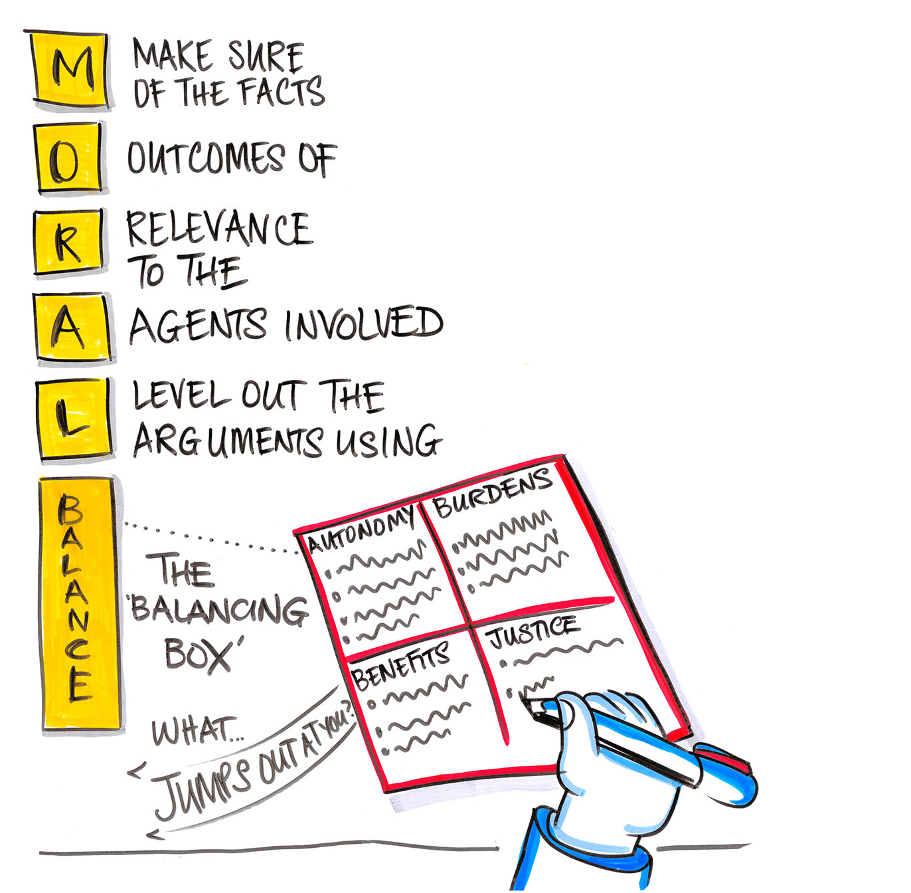

## Background

The Nottingham University Hospitals Ethics Committee has successfully run for many years and 
has a large and committed membership including staff from all parts of the Trust and lay members. The committee uses the [ethical framework](http://www.moralbalance.org/resources/COVID-19-/MORAL-Balance-Template---generic.docx) developed by Drs Dan Harvey & Dale Gardiner, Critical Care Consultants at Nottingham University Hospitals NHS Trust.

## Framework

The website for the [MORAL Balance Framework](http://www.moralbalance.org/) is comprehensive in its information around Moral Balance and has been updated with Covid-19 related information including [hypothetical cases](http://www.moralbalance.org/covid19/covid19hypothetical/). 

